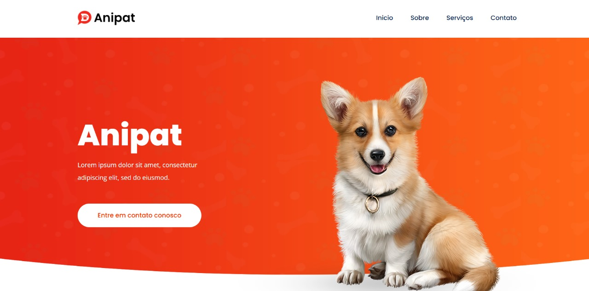

<h2>Sobre o projeto</h2>

<b>"Projeto sua clínica de pets 🐾. Este site oferece uma experiência completa para donos de animais, com uma interface amigável e recursos avançados, O objetivo é proporcionar uma plataforma segura e prática, com uma navegação simples e um design responsivo, com foco na usabilidade e no conforto do usuário, garantindo uma jornada de uso fluida. 🐶🐱💻"</b>

## 👉 Visualizar Site: <a href='https://anipat-tan.vercel.app/'>Ver Site</a>

### » Tecnologias utilizadas: HTML, CSS, SASS, JS, PHP.

##

<h2>Capturas de tela do projeto 📸</h2>
 
<h3 align='center'>Página Inicial 🏡</h3>

  

